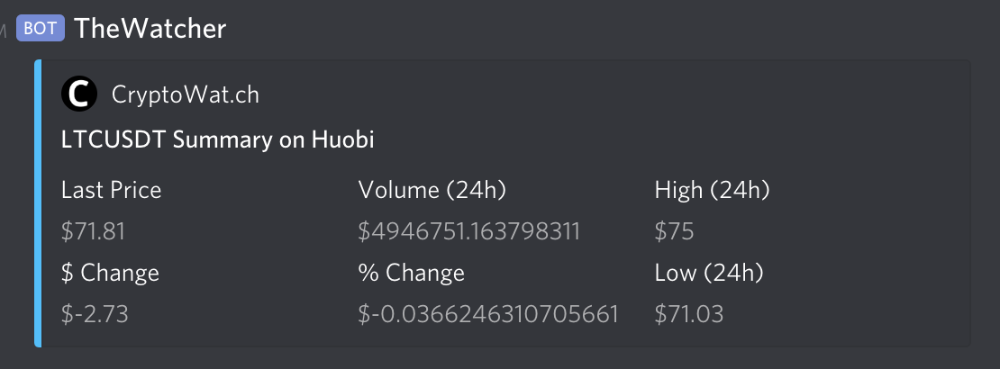

## CryptoWatch Bot

This is a [Flask](https://palletsprojects.com/p/flask/) bot for [Cryptowat.ch](https://cryptowat.ch) to Discord.



## Get started
Ideally, use a [virtual environment](https://virtualenv.pypa.io/en/latest/).

Install modules:
`$ pip install -r requirements.txt`

To start a local server:
`python -m flask run`

Can be deployed to zappa
https://github.com/Miserlou/Zappa

You'll need the following environment variables:
```
export FLASK_APP=watch-bot.py
export DISCORD_API_KEY=
```